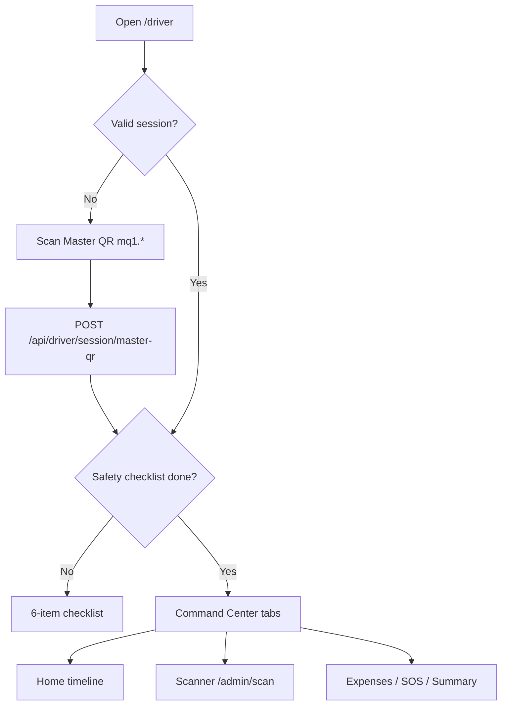

# Driver's Digital Command Center

Mobile-first PWA at **`/driver`** — no app store; optimized for gloves, sunlight, and patchy 4G.

## UX principles

| Principle | Implementation |
|-----------|----------------|
| Large touch | Min 56px targets, bottom nav with 28px icons |
| High contrast | Black / `#facc15` yellow / white |
| Zero daily login | Master QR on bus dashboard → day session JWT |
| Offline manifest | Service Worker + `localStorage` cache |
| Instant scan feedback | `navigator.vibrate` + full-screen result card |

## Flow



## Security — trip-scoped manifest

1. **Master QR** JWT embeds `tenant_id`, `trip_id`, `exp` (24h).
2. **Exchange** returns driver `access_token` with same `trip_id` claim.
3. **`GET /api/driver/manifest`** rejects tokens without `trip_id`; returns boarding data only for that trip.
4. Driver cannot change `tripId` in UI without scanning a new Master QR (session cleared on logout).

Ticketing scan still uses `driverApiKey` + `tripId` from session (`localStorage.driverActiveTripId`).

## Frontend layout

```text
src/pages/driver/DriverCommandCenter.jsx   # SPA shell + tabs
src/components/driver/
  MasterQrGate.jsx          # Zero-login
  DailyManifest.jsx         # Timeline + boarding count
  ScannerPanel.jsx          # Camera → POST /admin/scan
  ExpenseLog.jsx            # Receipt photo capture
  SafetyChecklist.jsx       # Pre-departure gate
  DaySummary.jsx            # KM / passengers / earnings
  EmergencyBar.jsx          # SOS + issue types
  DriverTicketScanner.jsx   # Vibration wrapper
src/lib/driver/driverSession.js
src/services/driverPortalApi.js
public/driver-sw.js         # Offline manifest cache
```

## API map

| UI | Endpoint |
|----|----------|
| Master QR | `POST /api/driver/session/master-qr` |
| Manifest | `GET /api/driver/manifest` (Bearer session) |
| Scan | `POST /admin/scan` |
| Expenses | `POST /api/v1/drivers/{id}/expenses` |
| Safety | `POST /api/v1/drivers/.../safety-checklist/*` |

## Dev testing

1. `npm run dev` → http://localhost:5173/driver  
2. Without backend: paste any text in Master QR field (DEV fallback → trip 1).  
3. Complete safety checklist → use Scan tab.  

With backend: issue Master QR from `POST /api/v1/operations/master-qr` (admin JWT).

## PWA

Add to home screen on iOS/Android. Service worker registers on first visit to `/driver`.
