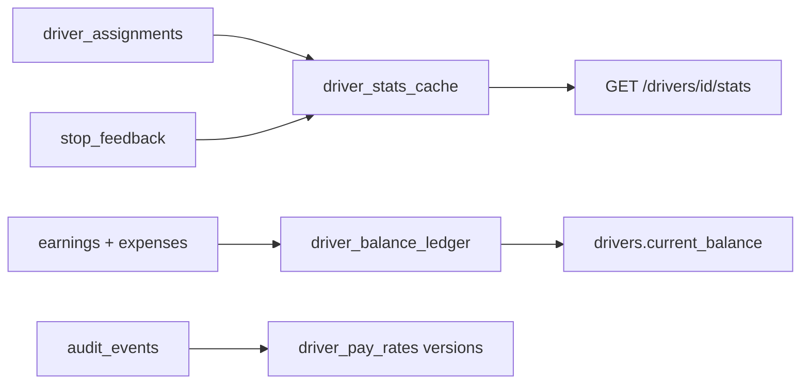

# Driver Personnel & Logistics Management

SaaS module for personnel data, logistics, financial tracking, and performance analytics.

## Architecture

```text
platform/drivers/
├── domain.py           # Dataclasses & enums
├── registry.py         # CRUD drivers
├── stats.py            # Cached metrics + GET /stats logic
├── document_vault.py   # Licenses/certs + 30-day alerts
├── finance.py          # Immutable earnings/expenses + balance ledger
├── payroll.py          # Monthly payout summary (accounting export)
└── availability.py     # Shift conflict detection
```

## Data flow



## Immutability rules

| Entity | Rule |
|--------|------|
| `driver_earnings` / `driver_expenses` | Append-only; DB triggers block UPDATE/DELETE |
| Pay rate changes | New row in `driver_pay_rates`; `superseded_at` on previous; audit `financial=true` |
| Balance | Updated only via `DriverFinanceService` ledger entries |

## API (`/api/v1/drivers`)

| Method | Path | Description |
|--------|------|-------------|
| GET | `/` | List drivers |
| POST | `/` | Create driver |
| GET | `/{id}` | Profile |
| GET | `/{id}/stats` | Cached performance + feedback |
| GET/POST | `/{id}/documents` | Document vault |
| POST | `/{id}/earnings` | Record commission |
| POST | `/{id}/expenses` | Record fuel/tolls/etc. |
| POST | `/{id}/pay-rates` | Versioned rate change |
| GET | `/{id}/payout-summary` | Monthly payout breakdown |
| GET | `/{id}/payout-summary/export` | Accounting software JSON export |
| GET | `/{id}/availability` | Free for assignment? |

## Workers

- `refresh_driver_stats_cache` — recompute kms/hours/ratings (every 6h or post-trip)
- `alert_driver_document_expiry` — 30 days before `expires_at`

## Sales angle

Link `avg_passenger_rating` from `stop_feedback` (micro-feedback per stop) to driver stats — owners reward top performers using `bonus_structure` thresholds.
