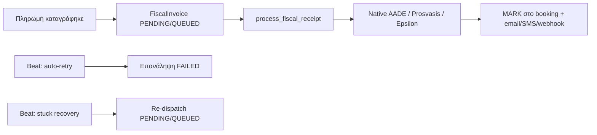

# Fiscal pipeline — Admin runbook

Οδηγός λειτουργίας για έκδοση φορολογικών αποδείξεων (myDATA MARK), Celery workers και reconciliation πληρωμών.

---

## 1. Τι κάνει το pipeline



**Τρέχουσα ροή (μετά capture πληρωμής):**

1. `BookingPaymentService` καταγράφει ποσό → δημιουργεί `FiscalInvoice` (είδος: `DOWN_PAYMENT` / `FULL_PAYMENT` / `FINAL_SETTLEMENT`).
2. `dispatch_fiscal_receipt()` στέλνει Celery task `process_fiscal_receipt` (ή inline fallback αν δεν τρέχει worker).
3. Worker καλεί provider μέσω `FiscalFactory` → αποθηκεύει MARK / σφάλμα.
4. Σε επιτυχία: email (`fiscal_receipt_issued`), προαιρετικά SMS + browser push (Wallet) + partner webhook `fiscal.receipt_issued`.

**Triggers έκδοσης:**

| Πηγή | Σημείο εισόδου |
|------|----------------|
| Stripe `payment_intent.succeeded` | `app/api/payments_webhook.py` |
| Επιβεβαίωση τραπεζικής κατάθεσης | `payment_settings_router` → `record_bank_deposit` |
| Μετρητά (γραφείο / οδηγός) | `recordCashPayment` API |
| Χειροκίνητη έκδοση admin | `POST .../bookings/{id}/issue-fiscal` |
| Επανάληψη admin / auto-retry | `POST .../fiscal-invoices/{id}/retry` |
| **Ακύρωση κράτησης (admin)** | `POST .../bookings/{id}/cancel` → πιστωτικό ανά ISSUED απόδειξη |

**Ακύρωση + πιστωτικό:** Για κάθε εκδοθείσα απόδειξη (MARK) δημιουργείται `FiscalInvoice` τύπου `credit_note` (myDATA `11.4` / `5.2`) και αποστέλλεται μέσω του ίδιου Celery pipeline. Idempotent ανά αρχική απόδειξη.

**PDF για πελάτη:** Μετά την έκδοση MARK → Wallet / κράτηση → **Λήψη PDF** (`/wallet/receipt/{bookingId}`) → Ctrl+P / «Αποθήκευση ως PDF».

**Push (browser):** Πελάτης → Wallet → **Ασφάλεια** → «Ενεργοποίηση push». Απαιτεί `WEB_PUSH_VAPID_*` στο backend. Admin toggle: **Browser push όταν εκδοθεί MARK**.

---

## 2. Τι πρέπει να τρέχει

**Γρήγορο local setup:** `make dev` (Postgres + Redis) → [LOCAL-DEV.md](./LOCAL-DEV.md)

### Development (3 terminals + Redis)

```bash
# Terminal 1 — API
make dev-api
# ή: cd backend && uvicorn main:app --reload --host 0.0.0.0 --port 8000

# Terminal 2 — Celery worker (fiscal + webhooks + άλλα tasks)
make celery-worker

# Terminal 3 — Celery beat (auto-retry, stuck recovery, SMS, κ.λπ.)
make celery-beat
```

**Redis** (broker): `CELERY_BROKER_URL=redis://localhost:6379/0`

Χωρίς worker/Redis, το `dispatch_fiscal_receipt` τρέχει **inline fallback** στο ίδιο process — OK για dev, **όχι** για production φόρτου.

### Production checklist

- [ ] API + Postgres
- [ ] Redis διαθέσιμο
- [ ] Celery worker (`celery -A workers.celery_app worker`)
- [ ] Celery beat (`celery -A workers.celery_app beat`)
- [ ] Provider credentials (AADE / Prosvasis / Epsilon) ρυθμισμένα ανά tenant
- [ ] `STRIPE_CHECKOUT_WEBHOOK_SECRET` (ή `STRIPE_WEBHOOK_SECRET`)
- [ ] SMTP για email με MARK

---

## 3. Celery Beat — fiscal tasks

| Task | Συχνότητα | Ρόλος |
|------|-----------|--------|
| `workers.tasks.process_fiscal_receipt` | on-demand | Έκδοση μίας απόδειξης |
| `workers.tasks.retry_failed_fiscal_receipts` | :10, :25, :40, :55 κάθε ώρα (~15 λεπτά) | Auto-retry FAILED |
| `workers.tasks.recover_stuck_fiscal_receipts` | κάθε 10 λεπτά | Re-dispatch PENDING/QUEUED > threshold |

Ορίζονται στο `backend/workers/celery_app.py`.

---

## 4. Μεταβλητές περιβάλλοντος

### Celery / Redis

| Μεταβλητή | Default | Σημειώσεις |
|-----------|---------|------------|
| `CELERY_BROKER_URL` | `redis://localhost:6379/0` | Broker + result backend |

### Auto-retry αποτυχιών

| Μεταβλητή | Default | Σημειώσεις |
|-----------|---------|------------|
| `FISCAL_AUTO_RETRY_ENABLED` | `true` | `false` = απενεργοποίηση beat retry |
| `FISCAL_AUTO_RETRY_MAX` | `3` | Μέγιστες αυτόματες προσπάθειες ανά invoice |
| `FISCAL_AUTO_RETRY_COOLDOWN_MINUTES` | `30` | Αναμονή μεταξύ retries |
| `FISCAL_AUTO_RETRY_BATCH_LIMIT` | `25` | Batch ανά tenant ανά κύκλο |

### Stuck recovery

| Μεταβλητή | Default | Σημειώσεις |
|-----------|---------|------------|
| `FISCAL_STUCK_RECOVERY_ENABLED` | `true` | |
| `FISCAL_STUCK_MINUTES` | `45` | PENDING/QUEUED παλαιότερα → re-dispatch |
| `FISCAL_STUCK_BATCH_LIMIT` | `30` | |

### Admin email alerts (failed / stuck)

| Μεταβλητή | Default | Σημειώσεις |
|-----------|---------|------------|
| `FISCAL_ALERT_ENABLED` | `true` | Απενεργοποίηση όλων των fiscal admin emails |
| `FISCAL_ALERT_DIGEST_HOUR` | `8` | Ώρα digest (Europe/Athens) — Celery beat |
| `FISCAL_ALERT_IMMEDIATE_COOLDOWN_MINUTES` | `60` | Ελάχιστο διάστημα μεταξύ immediate alerts |
| `FISCAL_ALERT_RECONCILIATION_DAYS` | `7` | Παράθυρο reconciliation στο digest |
| `ADMIN_NOTIFICATION_EMAIL` | — | Fallback αν κενό στο Control Panel |

**Control Panel → Πληρωμές:** `notify_admin_on_fiscal_issues` (απαιτεί και `notify_admin_on_payment`).

- **Digest:** καθημερινά όταν υπάρχουν failed / stuck / reconciliation gaps
- **Immediate:** μετά αποτυχία έκδοσης (με cooldown)

### Native AADE (πλατφόρμα / dev)

| Μεταβλητή | Default | Σημειώσεις |
|-----------|---------|------------|
| `AADE_MODE` | `stub` | `production` / `signed` / `stub` |
| `AADE_SECRETS_BACKEND` | `dev` | `vault`, `aws`, `env` |
| `AADE_API_URL` | dev URL | Production myDATA endpoint |
| `AADE_VAT_NUMBER` | — | ΑΦΜ εκδότη (fallback) |
| `AADE_USER_ID` | — | |
| `AADE_SUBSCRIPTION_KEY` | — | |
| `AADE_CERT_PATH` | — | `.p12` για υπογραφή |
| `AADE_CERT_PASSWORD` | — | |
| `AADE_{TENANT_UUID}_VAT` | — | Per-tenant override (UUID με `_`) |

### Κρυπτογράφηση tenant secrets (Prosvasis/Epsilon)

| Μεταβλητή | Σημειώσεις |
|-----------|------------|
| `FISCAL_ENCRYPTION_KEY` | Fernet key για `*_enc` πεδία στο `tenants.settings_json` |

### Stripe webhook

| Μεταβλητή | Σημειώσεις |
|-----------|------------|
| `STRIPE_CHECKOUT_WEBHOOK_SECRET` | B2C PaymentIntent (προτεραιότητα) |
| `STRIPE_WEBHOOK_SECRET` | Fallback |

### Ειδοποιήσεις μετά MARK

| Μεταβλητή | Default | Σημειώσεις |
|-----------|---------|------------|
| `SMS_ENABLED` | `false` | Απαιτείται για SMS στον πελάτη |
| `WEBHOOK_SIGNING_SECRET` | `dev-webhook-secret` | Υπογραφή partner webhooks |

Οι διακόπτες **SMS / ERP webhook ανά tenant** είναι στο Control Panel → **Πληρωμές** (`notify_sms_on_fiscal_receipt`, `notify_erp_on_fiscal_receipt`).

### SMTP (email με MARK)

Βλ. `backend/.env.example` — `SMTP_HOST`, `SMTP_USER`, `SMTP_PASSWORD`, `SMTP_FROM`.

---

## 5. Ρύθμιση tenant (Admin UI)

| Οθόνη | Διαδρομή | Τι ρυθμίζεις |
|-------|----------|--------------|
| **Φορολογία** | Ρυθμίσεις → **Φορολογία** | Provider (`native_aade`, `prosvasis`, `epsilon`), ΑΦΜ, σειρές, API secrets |
| **Πληρωμές** | Ρυθμίσεις → **Πληρωμές** | Τράπεζες, μεθόδοι πληρωμής, fiscal KPIs, ουρά, reconciliation |
| **Partner webhooks** | Ρυθμίσεις → Growth | Event `fiscal.receipt_issued` για ERP |
| **Κρατήσεις** | BackOffice → Κρατήσεις | MARK ανά κράτηση, χειροκίνητη έκδοση / επανάληψη |

API ρυθμίσεων fiscal: `GET/PATCH /api/v1/settings/fiscal`

---

## 6. Reconciliation — workflow διαχειριστή

**Πού:** Ρυθμίσεις → Πληρωμές → ενότητα **Reconciliation πληρωμών vs fiscal**

| Κατάσταση | Σημασία | Ενέργεια |
|-----------|---------|----------|
| **Συμφωνία** | Πληρώθηκε = εκδόθηκε fiscal | — |
| **Λείπει fiscal** | Πληρωμή > εκδοθέντα (χωρίς failed) | **Έκδοση** |
| **Αποτυχία** | Υπάρχει FAILED invoice | **Επανάληψη** |
| **Σε εξέλιξη** | PENDING / QUEUED | Αναμονή ή stuck recovery |

**Προβολή λίστας:** dropdown **Μόνο κενά** / **Όλες οι κρατήσεις**  
**Export:** **CSV reconciliation** (ανά την επιλεγμένη προβολή)

**Κλικ** στο booking id / PNR → άνοιγμα κράτησης στο BackOffice.

**Προτεραιότητα status (backend):** Αποτυχία → Σε εξέλιξη → Λείπει fiscal → Συμφωνία.

**Σημείωση:** Αν υπάρχει FAILED invoice, το manual **Έκδοση** απορρίπτεται — χρησιμοποίησε **Επανάληψη**.

---

## 7. Χειροκίνητη ανάκτηση

### Admin UI

1. **Κράτηση** → ενότητα Φορολογικές αποδείξεις → **Επανάληψη** / **Έκδοση απόδειξης**
2. **Πληρωμές** → ουρά fiscal → **Επανάληψη** σε FAILED
3. **Reconciliation** → **Έκδοση** / **Επανάληψη** ανά γραμμή

### API (super admin / platform)

```
POST /api/admin/platform/fiscal-invoices/{id}/retry
POST /api/admin/platform/bookings/{booking_key}/issue-fiscal
GET  /api/admin/platform/fiscal-queue
GET  /api/admin/platform/fiscal-stats
GET  /api/admin/platform/fiscal-reconciliation?only_gaps=true|false
GET  /api/admin/platform/fiscal-reconciliation/export
GET  /api/admin/platform/payment-audit/export?fiscal_only=true
```

### Celery χειροκίνητα (shell)

```bash
cd backend
celery -A workers.celery_app call workers.tasks.retry_failed_fiscal_receipts
celery -A workers.celery_app call workers.tasks.recover_stuck_fiscal_receipts
```

---

## 8. Pipeline health (dashboard)

Στο panel **Φορολογικές εκκολήσεις** εμφανίζονται:

- KPIs (εκδόθηκαν, αποτυχίες, pending, success rate)
- Γράφημα 14 ημερών
- **Pipeline health:** `stuck_candidates`, `oldest_open_minutes`, flags auto-retry / stuck recovery

| `health` | Σημασία |
|----------|---------|
| `ok` | Χωρίς failures και χωρίς ανοιχτά |
| `busy` | Υπάρχουν pending/queued |
| `degraded` | Υπάρχουν failures |

Το UI κάνει **auto-polling κάθε 8s** όταν υπάρχουν γραμμές σε εξέλιξη ή items στην ουρά.

### HTTP monitoring (`/health`, `/api/v1/health`)

Δημόσιο endpoint (χωρίς auth) με snapshot:

```json
{
  "status": "ok",
  "redis": { "status": "ok", "broker": "redis://..." },
  "database": { "status": "ok" },
  "fiscal": {
    "health": "ok",
    "failed": 0,
    "pending": 0,
    "queued": 0,
    "stuck_candidates": 0,
    "pipeline": { "auto_retry_enabled": true, ... }
  }
}
```

| `status` (root) | HTTP | Σημασία |
|-----------------|------|---------|
| `ok` | 200 | DB + Redis OK, fiscal όχι degraded |
| `degraded` | 200 | Redis down ή fiscal failures/stuck |
| `unhealthy` | 503 | DB unreachable |

Γρήγορο liveness χωρίς fiscal queries: `GET /api/v1/health?include_fiscal=false`

Το `make fiscal-smoke --api-base ...` διαβάζει αυτό το block όταν δεν υπάρχει admin token.

---

## 9. Αντιμετώπιση προβλημάτων

| Σύμπτωμα | Πιθανή αιτία | Έλεγχος |
|----------|--------------|---------|
| Πληρωμή OK, χωρίς MARK | Celery worker down | `make celery-worker`, Redis, logs worker |
| Invoice κολλημένο σε QUEUED > 45 λεπτά | Worker/beat off ή provider timeout | Beat + `recover_stuck_fiscal_receipts` logs |
| FAILED μετά από πληρωμή | Λάθος credentials / AADE API | Audit log, `error_message` στο invoice |
| «Χρησιμοποιήστε επανάληψη» στο manual issue | Υπάρχει FAILED | Reconciliation → **Επανάληψη** |
| Email χωρίς MARK | SMTP OK αλλά fiscal failed | Έλεγξε fiscal status πριν το email event |
| SMS δεν στάλθηκε | `SMS_ENABLED=false` ή χωρίς τηλέφωνο | Payment settings + booking metadata |
| ERP webhook αποτυχία | Λάθος URL / secret | Growth → Partner webhooks + `partner_webhooks.log` |

**Χρήσιμα logs:**

- Celery worker stdout
- `fiscal_receipt_worker` exceptions
- Payment audit (`fiscal_receipt_issued`, `fiscal_receipt_failed`, `fiscal_retry_*`)

**Dev tip:** Frontend proxy συχνά στο `http://127.0.0.1:8010` — βεβαιώσου ότι API + worker τρέχουν στο ίδιο backend env.

---

## 10. Partial payments — είδη απόδειξης

| Κατάσταση πληρωμής | `invoice_kind` |
|--------------------|----------------|
| Πρώτη δόση | `DOWN_PAYMENT` |
| Εφάπαξ / πλήρης | `FULL_PAYMENT` |
| Τελικό υπόλοιπο | `FINAL_SETTLEMENT` |

Λογική: `resolve_invoice_kind()` στο `fiscal_invoice_service.py`.

**Smoke test (terminal):**

```bash
make fiscal-smoke
# ή με API:
cd backend && python -m scripts.fiscal_pipeline_smoke --api-base http://127.0.0.1:8010 --token "$SAAS_TOKEN"
```

**AADE E2E (myDATA sandbox):**

```bash
# Mock HTTP — CI / χωρίς credentials
make fiscal-aade-e2e

# Live mydataapidev (απαιτεί test credentials)
AADE_USER_ID=... AADE_SUBSCRIPTION_KEY=... make fiscal-aade-e2e-live
```

---

## 11. Prometheus metrics

Endpoint: **`GET /metrics`** (και `/api/v1/metrics`) — Prometheus text format.

Σε κάθε scrape ενημερώνονται gauges από τη βάση (pending/queued/failed/issued, stuck, open).

| Metric | Τύπος | Περιγραφή |
|--------|-------|-----------|
| `fiscal_invoices{status}` | Gauge | Τρέχον πλήθος ανά status |
| `fiscal_stuck_candidates` | Gauge | PENDING/QUEUED παλιά από threshold |
| `fiscal_open_invoices` | Gauge | pending + queued + failed |
| `fiscal_dispatch_total{transport}` | Counter | celery / inline dispatch |
| `fiscal_processing_total{outcome,provider,invoice_kind}` | Counter | Αποτελέσματα worker |
| `fiscal_provider_duration_seconds{provider}` | Histogram | Latency provider API |
| `fiscal_provider_errors_total{provider}` | Counter | Αποτυχίες provider |
| `fiscal_stuck_recovery_redispatched_total` | Counter | Beat stuck recovery |
| `fiscal_auto_retry_total` | Counter | Beat auto-retry |

**Απενεργοποίηση:** `METRICS_ENABLED=false`

**Γρήγορος έλεγχος:**

```bash
curl -s http://localhost:8000/metrics | findstr fiscal_
```

---

## 12. Σχετικά αρχεία

| Περιοχή | Path |
|---------|------|
| Dispatch μετά πληρωμή | `backend/app/services/payment_dispatch.py` |
| Worker έκδοσης | `backend/app/workers/fiscal_receipt_worker.py` |
| Celery tasks | `backend/workers/tasks.py`, `celery_app.py` |
| Providers | `backend/travel_platform/compliance/fiscal_factory.py` |
| Reconciliation | `backend/app/services/fiscal_reconciliation_service.py` |
| Metrics | `backend/app/observability/fiscal_metrics.py`, `app/api/metrics.py` |
| Web Push | `backend/travel_platform/notifications/web_push_service.py`, `api/customer_push_router.py`, `public/sw.js` |
| AADE E2E | `backend/tests/test_fiscal_aade_e2e.py`, `scripts/fiscal_aade_e2e.py` |
| Admin UI | `src/components/admin/PaymentManagementPanel.jsx`, `FiscalReceiptsSection.jsx` |

Για γενικό Celery setup (abandoned carts, SMS): [GROWTH-AND-CELERY.md](./GROWTH-AND-CELERY.md).
