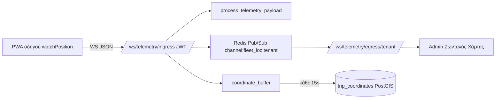

# Project OLYMPUS — Driver Telemetry PWA (Αρχιτεκτονική)

GPS στόλου μέσω **smartphone οδηγών** (χωρίς hardware trackers).  
Stack: **FastAPI + PostGIS + Redis** backend, **Vite + React** frontend.

---

## Ροή δεδομένων



---

## Μέρος 1 — PWA Οδηγού

| Στοιχείο | Αρχείο |
|----------|--------|
| UI «Έναρξη / Τέλος Βάρδιας» | `src/components/driver/DriverShiftTelemetry.jsx` |
| Geolocation engine | `src/lib/driver/driverGeolocation.js` |
| WebSocket emitter | `src/lib/driver/driverTelemetryWs.js` |
| Screen Wake Lock | `src/lib/driver/wakeLock.js` |
| Καρτέλα οδηγού | `/driver?tab=gps` στο `DriverCommandCenter.jsx` |
| PWA manifest | `public/driver-telemetry-manifest.webmanifest` |
| Εικονίδια PWA | `public/icons/driver-pwa-192.png`, `driver-pwa-512.png`, `driver-pwa.svg` |
| Offline σελίδα | `public/driver-offline.html` (ελληνικά) |
| Service worker | `public/driver-sw.js` — cache assets + offline fallback |

**Payload (κάθε ~4s όταν είναι online):**

```json
{
  "lat": 38.123,
  "lng": 23.456,
  "speed": 52.3,
  "heading": 180,
  "driver_id": "…",
  "tenant_id": "…",
  "trip_id": 1,
  "timestamp": 1710000000000,
  "bus_plate": "XAH-4021",
  "driver_name": "Nikos"
}
```

**Έλεγχος ταυτότητας:** JWT συνεδρίας Master QR → `?token=` στο WebSocket URL.

---

## Μέρος 2 — Backend ingestion

| Στοιχείο | Αρχείο |
|----------|--------|
| WS ingress | `backend/api/ws_telemetry.py` → `/ws/telemetry/ingress` |
| WS egress | `/ws/telemetry/egress/{tenant_id}` |
| Normalize + fan-out | `travel_platform/telemetry/fleet_ingress.py` |
| Redis pub/sub | `travel_platform/telemetry/fleet_pubsub.py` |
| Admin WS hub | `travel_platform/telemetry/fleet_ws_hub.py` |
| Buffer συντεταγμένων | `travel_platform/telemetry/coordinate_buffer.py` |
| PostGIS flush worker | `travel_platform/telemetry/coordinate_flush_worker.py` |
| Model / migration | `app/models/trip_coordinate.py`, `alembic/versions/008_trip_coordinates.py` |

**Μεταβλητές περιβάλλοντος:**

```env
REDIS_URL=redis://localhost:6379/0
TELEMETRY_COORD_FLUSH_SEC=15
TELEMETRY_COORD_BATCH=500
```

**Migration:**

```powershell
cd backend
alembic upgrade head
```

**Tests:**

```powershell
cd backend
python -m unittest tests.test_fleet_telemetry_ws -v
```

---

## Μέρος 3 — Backoffice «Λειτουργίες Στόλου»

| Στοιχείο | Αρχείο |
|----------|--------|
| Sidebar | **Λειτουργίες Στόλου** → Ζωντανός Χάρτης, Ενεργοί Οδηγοί (`sidebarNav.js`) |
| Ζωντανός χάρτης (WS + glide) | `FleetLiveMapWebSocket.jsx` → `FleetLiveMapMapbox.jsx` ή `FleetLiveMapLeaflet.jsx` |
| Λίστα ενεργών οδηγών | `src/components/admin/ActiveDriversList.jsx` |
| WS context (ένα socket ανά session) | `src/context/FleetTelemetryContext.jsx` |

Το **tenant_id** για το egress WebSocket επιλύεται αυτόματα από:
1. Impersonation JWT (αν είστε superadmin σε άλλο tenant)
2. `localStorage` (`saas_tenant_id`)
3. Fallback demo: `VITE_DEMO_TENANT_ID`

Ο χάρτης χρησιμοποιεί **Mapbox GL** (`react-map-gl`) όταν οριστεί `VITE_MAPBOX_TOKEN`· αλλιώς **Leaflet / CARTO** (χωρίς token).

**Mapbox env** (προαιρετικό):

```env
VITE_MAPBOX_TOKEN=pk.eyJ...
VITE_MAPBOX_STYLE=mapbox://styles/mapbox/streets-v12
```

**PWA manifest (ελληνικά):** όνομα «GPS Οδηγού» στην αρχική οθόνη · custom εικονίδιο λεωφορείου/GPS.

**Offline:** χωρίς δίκτυο, το `/driver` εμφανίζει ελληνικό μήνυμα («Δεν υπάρχει σύνδεση»). Το manifest API επιβατών παραμένει cached.

**Ειδοποιήσεις οδηγού online/offline:**
- Backend: `driver_shift_tracker.py`, `driver_shift_notifications.py`
- WebSocket alert: `DRIVER_ONLINE` / `DRIVER_OFFLINE` στο `TelemetryAlertsPanel`
- Admin Web Push: `/api/admin/push/*` + `AdminFleetPushPanel` στον ζωντανό χάρτη
- Ρυθμίσεις: `notify_push_on_driver_shift`, `notify_admin_on_driver_shift` στο payment security

**Ιστορικό διαδρομής (playback & σύγκριση):**
- API playback: `GET /api/admin/telemetry/trips/{trip_id}/route`
- API σύγκριση: `GET /api/admin/telemetry/trips/compare?trip_a=1&trip_b=2`
- Service: `trip_route_service.py`, `trip_route_compare.py`
- UI: **Ιστορικό Διαδρομής** → καρτέλες «Αναπαραγωγή» / «Σύγκριση 2 διαδρομών»

---

1. Εκκίνηση API + Redis (`make dev-infra` + `make dev-api` ή `docker compose`)
2. **Οδηγός:** `/driver` → Master QR → καρτέλα **GPS** → **Έναρξη Βάρδιας**
3. **Admin:** BackOffice → **Λειτουργίες Στόλου** → **Ζωντανός Χάρτης**
4. **Ιστορικό:** ίδιο δρομολόγιο → **Ιστορικό Διαδρομής** → Φόρτωση → Αναπαραγωγή
5. Legacy HTTP poll: **Live GPS (poll)** στο κύριο menu

---

## Σχετικά docs

- [TELEMETRY-FLEET.md](./TELEMETRY-FLEET.md)
- [OLYMPUS-TELEMATICS.md](./OLYMPUS-TELEMATICS.md)
- [PROJECT-OLYMPUS-ENTERPRISE-BLUEPRINT.md](./PROJECT-OLYMPUS-ENTERPRISE-BLUEPRINT.md)
