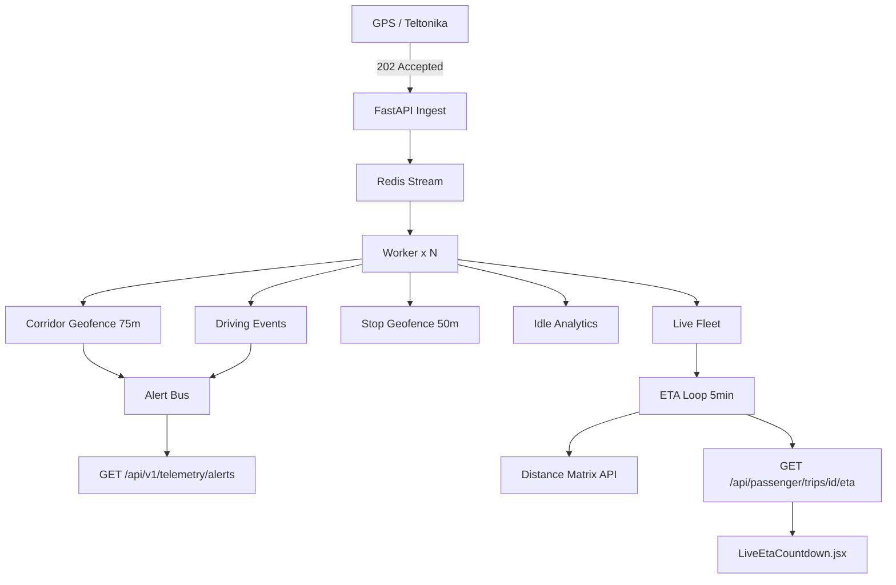

# Project OLYMPUS — Telematics Safety & ETA Intelligence

Three modules integrated into the existing telemetry pipeline (`POST /telemetry/update` → Redis Stream → async worker).

## Architecture



---

## 1. Unauthorized Route Alert (Corridor Geofence)

### Logic

| Parameter | Value | Why |
|-----------|--------|-----|
| Buffer | **50–100 m** (default **75 m**) | GPS jitter; 5 m causes false alerts |
| Min speed | 8 km/h | Ignore parking / terminal noise |
| Debounce | 3 consecutive off-corridor points | Reduces spike false positives |

**Corridor** = planned route `LineString` + buffer → polygon (PostGIS) or min distance to polyline segments (in-memory dev).

### PostGIS (production)

Spatial index: **GIST** on `geofence_corridor_cache.corridor_geom`.

```sql
-- Build corridor once per zone (meters on geography)
INSERT INTO geofence_corridor_cache (zone_id, corridor_geom)
SELECT id, ST_Buffer(route_geom::geography, buffer_m)::geometry
FROM geofence_zones WHERE trip_id = :trip_id;

-- Real-time check (uses R-Tree via GIST)
SELECT EXISTS (
  SELECT 1 FROM geofence_corridor_cache c
  JOIN geofence_zones z ON z.id = c.zone_id
  WHERE z.trip_id = :trip_id AND z.is_active
    AND ST_DWithin(
      c.corridor_geom::geography,
      ST_SetSRID(ST_MakePoint(:lng, :lat), 4326)::geography,
      0
    )
);
```

Distance outside corridor:

```sql
SELECT ST_Distance(
  ST_SetSRID(ST_MakePoint(:lng, :lat), 4326)::geography,
  z.route_geom::geography
) AS distance_m
FROM geofence_zones z WHERE z.trip_id = :trip_id;
```

**Alert:** `ROUTE_DEVIATION` → `TelemetryAlertBus` → `GET /api/v1/telemetry/alerts`.

**Code:** `backend/platform/telemetry/corridor_geofence.py`, `postgis_queries.py`.

---

## 2. Driving Behavior Score

### Preferred: Tracker Event ID (Teltonika)

Do **not** recompute G-force if the device sends events:

| Event ID | Type | Score Δ |
|----------|------|---------|
| 101 | HARSH_BRAKING | -8 |
| 102 | HARSH_ACCELERATION | -6 |
| 103 | HARSH_CORNERING | -5 |
| 105 | SPEEDING | -10 |

Ingest payload:

```json
{
  "tracker_event_id": 101,
  "vehicle_code": "XAH-4021",
  "latitude": 38.9,
  "longitude": 22.4,
  "speed_kmh": 45
}
```

### Fallback: Accel axes

If no `tracker_event_id`, compute magnitude \(\sqrt{x^2+y^2+z^2}/g\) and flag spike if \(|g-1| > 0.45\).

### Aggregated rating (1–100)

```python
# backend/platform/telemetry/driving_behavior.py
aggregated_driver_safety_rating(
    events_last_30d=12,
    distance_km_30d=2400,
    penalty_per_event=5,
)
# events_per_100km = (events / km) * 100
```

**API:** `GET /api/v1/telemetry/drivers/{driver_id}/safety`

**Schema:** `driving_events`, `driver_safety_profiles` in `deploy/postgres/olympus-telematics-schema.sql`.

---

## 3. Real-Time ETA Intelligence

### Traffic integration

- Env: `GOOGLE_MAPS_API_KEY`
- Refresh: `ETA_REFRESH_SECONDS` (default **300** = 5 min)
- Background: `start_eta_refresh_loop()` in FastAPI lifespan
- Provider: Google Distance Matrix `departure_time=now`, `duration_in_traffic`

### Passenger flow

1. Server computes `eta_seconds` to next stop.
2. **WebSocket** `ws://host/ws/passenger/eta/{trip_id}?tenant_id=...` — snapshot on connect + push on refresh / every 30s if subscribed.
3. HTTP fallback: `GET /api/passenger/trips/{trip_id}/eta` every **60s**.
4. `useLiveEta` sets `targetArrival = now + eta_seconds` and ticks every **1s** for smooth countdown.
5. On refetch, target is **blended** (35% new) to avoid jumps > 2 min.

### Admin alerts WebSocket

- `ws://host/ws/admin/telemetry/alerts?tenant_id=...`
- Snapshot on connect + push on `ROUTE_DEVIATION` / harsh driving events.
- UI: BackOffice → **Live GPS** → panel **Ασφάλεια & Telematics**.

### UI

- `LiveEtaCountdown.jsx` — large countdown + **Live Traffic** badge  
  - `Κίνηση: Αυξημένη` (heavy) — sets passenger expectation when bus is late.

**Code:** `eta_intelligence.py`, `passenger_portal.py`, `src/hooks/useLiveEta.js`.

---

## Database

| Table | Purpose |
|-------|---------|
| `geofence_zones` | Route LineString + buffer_m |
| `geofence_corridor_cache` | Buffered polygon (GIST) |
| `trip_telemetry` | All GPS points + on_corridor flag |
| `driving_events` | Harsh events / G spikes |
| `driver_safety_profiles` | Rolling score 1–100 |
| `route_deviations` | Deviation log |
| `trip_eta_snapshots` | ETA history |

Apply: `psql -f deploy/postgres/olympus-telematics-schema.sql`

---

## Scalability (50+ buses)

| Concern | Solution |
|---------|----------|
| Event loop blocking | Ingest **202 only**; process in Redis consumer (`count=100`, `block=2000`) |
| Geofence CPU | PostGIS GIST + precomputed corridor polygon |
| G-force CPU | Use `tracker_event_id` only in production |
| ETA API quota | Batch refresh every 5–10 min, not per GPS point |
| Admin UI | Poll alerts / fleet every 5s, not per point |

---

## Test

```bash
# GPS ingest
curl -X POST http://localhost:8000/telemetry/update \
  -H "Content-Type: application/json" \
  -H "X-Device-Key: dev-gps-key" \
  -d '{"tenant_id":"00000000-0000-0000-0000-000000000001","vehicle_code":"XAH-4021","trip_id":1,"latitude":38.5,"longitude":23.5,"speed_kmh":60,"engine_status":"on"}'

# Harsh braking (Teltonika)
curl -X POST http://localhost:8000/telemetry/update \
  -H "Content-Type: application/json" \
  -H "X-Device-Key: dev-gps-key" \
  -d '{"tenant_id":"00000000-0000-0000-0000-000000000001","vehicle_code":"XAH-4021","trip_id":1,"latitude":38.9,"longitude":22.4,"speed_kmh":40,"tracker_event_id":101}'

# Passenger ETA
curl http://localhost:8000/api/passenger/trips/1/eta

# Admin alerts (tenant JWT)
curl http://localhost:8000/api/v1/telemetry/alerts -H "Authorization: Bearer ..."
```

**Wallet:** `http://localhost:5173/wallet` → tab **Ταξίδι** → Live ETA card.
