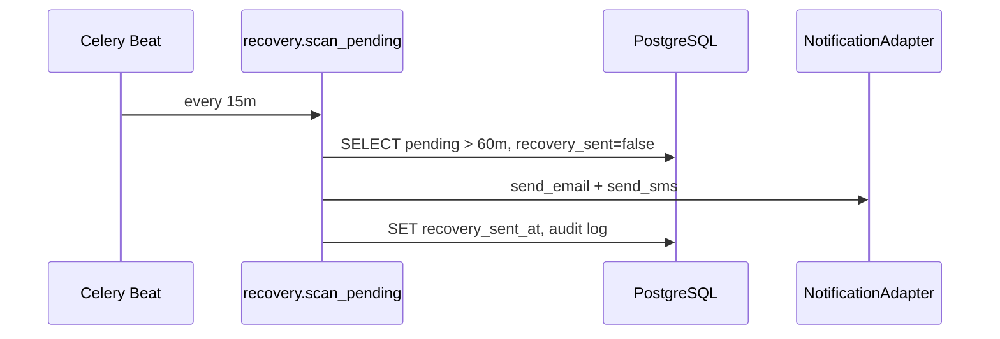

# Platform Modules — Structural Outline

Scalable SaaS backbone for AeroStride: revenue, operations, growth, and compliance.

## Driver management

See [`DRIVER-MANAGEMENT.md`](DRIVER-MANAGEMENT.md) — personnel, stats cache, finance immutability, payroll export, availability.

## Package map

```text
backend/
├── core/                          # Shared primitives
│   ├── config.py                  # PlatformSettings (env)
│   ├── base_service.py            # TenantScopedService
│   ├── exceptions.py
│   └── dependencies.py            # FastAPI deps (tenant session, audit ctx)
├── platform/
│   ├── tenant/
│   │   └── repository.py          # RLS + tenant_id enforcement
│   ├── revenue/
│   │   ├── abandoned_recovery.py  # Celery: 60m pending → email/SMS
│   │   └── dynamic_pricing.py     # Occupancy-based price rules
│   ├── operations/
│   │   ├── master_qr.py           # Driver manifest bootstrap token
│   │   └── safety_verification.py # Cleaning / safety checklist workflow
│   ├── growth/
│   │   ├── white_label.py         # Custom domain + CSS injection
│   │   └── partner_api.py         # Webhooks + partner integrations
│   └── compliance/
│       ├── audit_trail.py         # Immutable action log
│       └── aade_gateway.py        # Isolated fiscal signing boundary
├── workers/
│   ├── celery_app.py
│   └── tasks.py                   # Scheduled + event tasks
├── api/v1/
│   ├── router.py                  # Aggregates module routers
│   ├── revenue.py
│   ├── operations.py
│   ├── growth.py
│   └── partner.py
└── schemas/platform/              # Pydantic request/response models
```

## 1. Revenue maximization

| Module | Trigger | Storage | Output |
|--------|---------|---------|--------|
| Abandoned recovery | Celery beat every 15m | `bookings` WHERE status=PENDING AND age>60m | Email/SMS via provider adapter |
| Dynamic pricing | On quote / seat hold | `trips` capacity + `pricing_rules` | Adjusted `unit_price` |

**Flow — abandoned booking:**



## 2. Operational excellence

| Feature | Auth | Token lifetime |
|---------|------|----------------|
| Master QR | HMAC/JWT signed by platform | 24h, scope `manifest:read` + `trip_id` |
| Safety verification | Driver JWT | Per-trip checklist record |

## 3. Growth & ecosystem

| Feature | Config store | Edge (Traefik) |
|---------|--------------|----------------|
| White-label | `tenant_branding` table | `Host(custom_domain)` router |
| Partner API | `webhook_subscriptions` | Outbound HTTPS POST + HMAC signature |

## 4. Technical backbone

| Concern | Implementation |
|---------|----------------|
| Tenant isolation | `TenantContextMiddleware` + `SET LOCAL app.current_tenant` + repository base |
| Audit trail | Append-only `audit_events` (no UPDATE/DELETE); optional hash chain |
| AADE | `AadeGateway` in isolated module; credentials from Vault only |

## API surface (`/api/v1`)

| Method | Path | Module |
|--------|------|--------|
| GET | `/pricing/quote` | Dynamic pricing |
| POST | `/operations/master-qr` | Master QR issue |
| POST | `/operations/safety-checklist` | Safety verification |
| GET/PATCH | `/growth/branding` | White-label |
| POST | `/partners/webhooks` | Partner subscriptions |
| GET | `/compliance/audit` | Audit query (admin) |

## Worker processes

```text
api-blue/green  → FastAPI (sync HTTP)
worker          → Celery: abandoned_recovery, aade_transmit, webhook_dispatch
beat            → Celery Beat schedules
```

## Database additions (PostgreSQL)

See `deploy/postgres/platform-schema.sql` for RLS policies, `audit_events`, `tenant_branding`, `webhook_subscriptions`, `safety_verifications`, `pricing_rules`.
