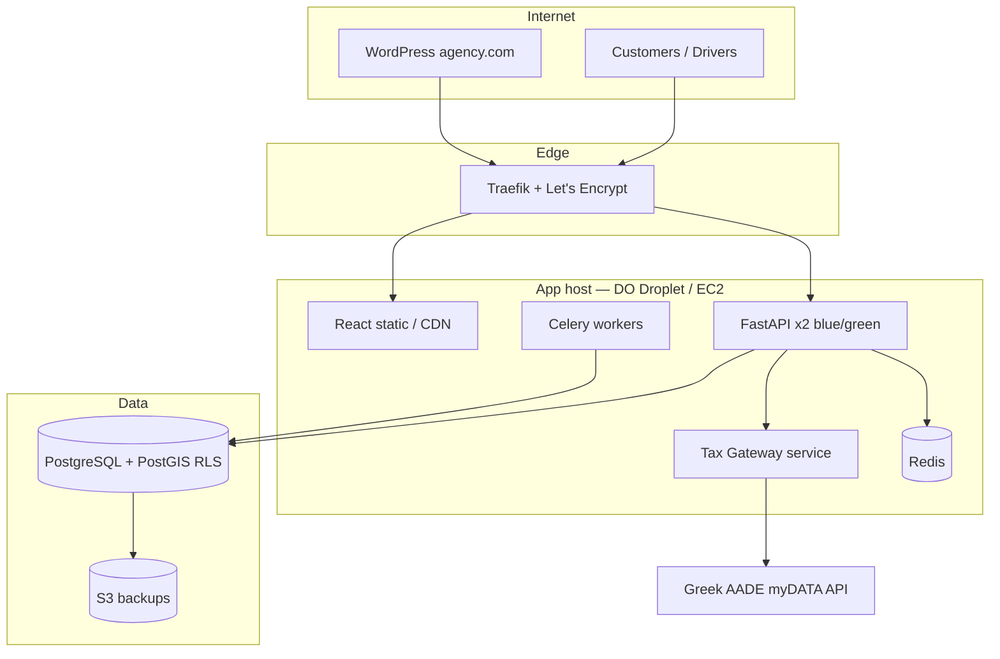
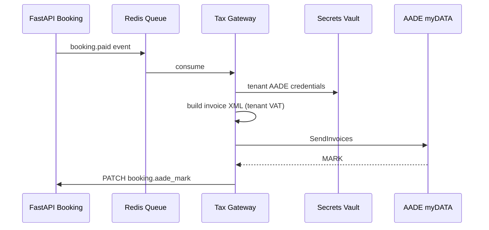

# Production Architecture — Travel SaaS

Strategy for deploying the AeroStride stack (WordPress + React/Vite frontend + FastAPI + PostGIS) on a single cloud VM or small cluster, with multi-tenant isolation, compliance, and zero-downtime releases.

---

## System context



| Surface | Domain example | Stack |
|---------|----------------|-------|
| Marketing / WP | `www.agency.com` | WordPress (PHP-FPM + MariaDB or external RDS) |
| Customer app | `app.agency.com` or WP `/my-trips` | React build behind Nginx |
| API | `api.travel-agency.com` | FastAPI (Uvicorn + Gunicorn) |
| Driver PWA | `driver.agency.com` | React driver scan (same bundle) |

---

## 1. Production-ready infrastructure (IaC)

### 1.1 Deployment target

**Recommended starting point:** one **DigitalOcean Droplet** (4 vCPU / 8 GB) or **AWS EC2** `t3.large` in `eu-central-1` (low latency to Greece).

| Option | When to use |
|--------|-------------|
| Single Droplet + Docker Compose | &lt; 5 agencies, &lt; 2k concurrent scans/hour |
| EC2 ASG (2+) + ALB + RDS | Holiday peaks, 10+ agencies, SLA requirements |
| Managed RDS PostGIS + ElastiCache | Offload DB/Redis ops early |

Artifacts in repo:

- `deploy/docker-compose.prod.yml` — production Compose (no dev bind mounts)
- `deploy/traefik/` — TLS + routing
- `deploy/scripts/backup-postgres-to-s3.sh` — nightly logical backup

### 1.2 `docker-compose.prod.yml` (summary)

Services:

| Service | Role |
|---------|------|
| `traefik` | TLS termination, HTTP→HTTPS, routing |
| `api-blue` / `api-green` | FastAPI (one active via Traefik label weight) |
| `worker` | Celery: AADE, SMS, manifest pre-warm |
| `redis` | Seat locks, QR replay cache, Celery broker |
| `postgres` | PostGIS (or remove if using managed RDS) |
| `wordpress` | Optional co-located WP (often separate) |

**Rules:**

- API containers **never** publish host ports; only Traefik exposes 443.
- Secrets via **Docker secrets** or `.env` excluded from git (`deploy/.env.prod.example`).
- Healthchecks: `GET /health` on API; Postgres `pg_isready`.

### 1.3 SSL — Traefik + Let's Encrypt

**DNS:**

- `A` `api.travel-agency.com` → Droplet IP  
- `A` / `CNAME` `www.travel-agency.com` → WP host  

**Traefik static config** (`deploy/traefik/traefik.yml`):

- Entrypoints: `web` (:80 redirect) → `websecure` (:443)
- Certificate resolver: `letsencrypt` (HTTP-01 or DNS-01 via Cloudflare)
- Routers:
  - `Host(\`api.travel-agency.com\`)` → `api` service (load-balanced blue/green)
  - `Host(\`www.travel-agency.com\`)` → `wordpress` service

**WordPress + API on same host:** two routers, two services; WP does not proxy API (browser calls `api.*` with CORS allowlist).

**Nginx alternative:** use `certbot --nginx` + separate `server` blocks; terminate TLS at Nginx, proxy `proxy_pass http://127.0.0.1:8000` for API. Traefik is preferred for automatic cert renewal and blue/green label switching.

#### 1.3.1 Why Traefik for SaaS (SSL + subdomains per customer)

Traefik is the edge router in `deploy/docker-compose.prod.yml` because it solves three jobs that otherwise need separate tools (Nginx + Certbot + manual vhost files):

| Job | Without Traefik | With Traefik |
|-----|-----------------|--------------|
| HTTPS | Manual certbot per domain | Let's Encrypt via `certificatesResolvers.letsencrypt` in `deploy/traefik/traefik.yml` |
| New hostname | Edit Nginx, reload, renew cert | Docker label or dynamic YAML; Traefik picks it up automatically |
| Blue/green API | Custom upstream weights | `loadbalancer.server.weight` on `api-blue` / `api-green` labels |

**Per-agency (tenant) subdomain pattern** — one platform, many brands:

```text
achillio.aerostride.app   → React (frontend) + tenant slug in Host header
api.aerostride.app        → FastAPI (shared API; tenant from JWT, not subdomain alone)
```

**DNS (once):**

- `A` `aerostride.app` → Droplet IP  
- `A` `*.aerostride.app` → same IP (wildcard for all tenant subdomains)

**Certificates:**

| Scale | ACME challenge | Traefik config |
|-------|----------------|----------------|
| Few fixed hosts (`api.*`, `app.*`) | HTTP-01 (current setup) | `httpChallenge` on entrypoint `web` |
| Many subdomains (`*.aerostride.app`) | **DNS-01** (Cloudflare / Route53) | Wildcard cert `*.aerostride.app` — HTTP-01 cannot issue wildcards |

Example DNS-01 block (add to `traefik.yml` when you enable Cloudflare):

```yaml
certificatesResolvers:
  letsencrypt:
    acme:
      email: "${ACME_EMAIL}"
      storage: /acme/acme.json
      dnsChallenge:
        provider: cloudflare
        resolvers:
          - "1.1.1.1:53"
```

**Routing tenant subdomains to the same frontend:**

- **Option A — one router, regex host:** `HostRegexp(\`{slug:[a-z0-9-]+}.aerostride.app\`)` → `frontend` service; React reads `window.location.hostname` or API resolves tenant by slug.
- **Option B — programmatic labels:** onboarding API runs `docker compose` / updates Compose labels: `traefik.http.routers.tenant-achillio.rule=Host(\`achillio.aerostride.app\`)` (fine for &lt; ~50 tenants; prefer Option A + wildcard cert beyond that).

See `deploy/traefik/dynamic/tenants.example.yml` for a file-provider template.

**Onboarding checklist (new customer):**

1. Insert `tenants` row with `slug` (e.g. `achillio`).
2. DNS already wildcard → **no DNS change per customer**.
3. Traefik serves HTTPS automatically (wildcard or per-host cert).
4. JWT / middleware sets `tenant_id` — subdomain is branding only unless you map `slug → tenant_id` in API.

### 1.4 PostgreSQL scaling & backups (multi-tenant PostGIS)

**Model:** single database, **shared schema**, `tenant_id` on every tenant-owned row + **Row Level Security (RLS)**.

| Phase | Capacity | Actions |
|-------|----------|---------|
| Phase 0 | 1–10 tenants | Single PostGIS instance, connection pool 20–50 |
| Phase 1 | 10–50 tenants | Read replica for reporting; PgBouncer in transaction mode |
| Phase 2 | 50+ tenants | RDS Multi-AZ; optional partition by `tenant_id` on `bookings` |

**Nightly backup to S3:**

1. `pg_dump -Fc --no-owner` per cluster (or `wal-g` for PITR).
2. Encrypt with KMS or `gpg --symmetric` before upload.
3. Lifecycle: 30 daily, 12 monthly.
4. Monthly restore drill to staging.

Script: `deploy/scripts/backup-postgres-to-s3.sh` (cron `0 2 * * *`).

**PostGIS:** enable extension once; index geo columns with `GIST`; keep trip/stop queries tenant-scoped.

---

## 2. SaaS multi-tenancy

### 2.1 Data isolation — FastAPI middleware + RLS

**Never trust client-supplied `tenant_id`.** Derive from JWT:

```text
Authorization: Bearer <access_token>
  → sub, tenant_id, roles
```

**Middleware flow:**

1. `TenantContextMiddleware` decodes JWT (RS256, issuer `aerostride-auth`).
2. Sets `request.state.tenant_id` and PostgreSQL session variable:
   ```sql
   SET LOCAL app.current_tenant = '<uuid>';
   ```
3. All repositories append `WHERE tenant_id = :tid` **and** rely on RLS as defense in depth.

**RLS policy example:**

```sql
ALTER TABLE bookings ENABLE ROW LEVEL SECURITY;
CREATE POLICY tenant_isolation ON bookings
  USING (tenant_id = current_setting('app.current_tenant')::uuid);
```

**Driver scan / admin scan:** JWT must include `role: driver` and `tenant_id`; scan endpoint validates `booking.tenant_id == request.state.tenant_id`.

See stub: `backend/middleware/tenant.py` (to implement).

### 2.2 Tenant onboarding (programmatic)

| Step | Action |
|------|--------|
| 1 | Stripe/webhook `checkout.session.completed` |
| 2 | Create `tenants` row (name, slug, plan, status) |
| 3 | Create default admin user (Auth0 / internal) |
| 4 | Seed: fleet templates, tax profile (ΑΦΜ, myDATA credentials **encrypted**) |
| 5 | WordPress: optional multisite blog OR API-only tenant (no WP per tenant) |
| 6 | S3 prefix `tenants/{id}/` for uploads, manifests |
| 7 | Emit `tenant.provisioned` → Tax Gateway registers AADE test credentials |

**Schema-per-tenant vs shared schema:** use **shared schema + RLS** unless legal requires hard isolation (then schema-per-tenant via `CREATE SCHEMA tenant_xxx`).

Folders (S3):

```text
s3://aerostride-prod/tenants/{tenant_id}/branding/
s3://aerostride-prod/tenants/{tenant_id}/aade/certs/
```

---

## 3. CI/CD & monitoring

### 3.1 GitHub Actions (template)

File: `.github/workflows/production.yml`

Pipeline stages:

1. **test** — `pytest` (API), lint frontend
2. **build** — Docker image → GHCR `ghcr.io/org/aerostride-api:${{ github.sha }}`
3. **deploy** — SSH or DO API: pull image, rolling update Compose stack

Deploy only on `push` to `main` with environment protection + manual approval for prod.

### 3.2 Observability (lightweight)

| Layer | Tool | Signals |
|-------|------|---------|
| Errors | **Sentry** (FastAPI + React SDK) | stack traces, release health |
| Metrics | **Prometheus** + **Grafana** | p50/p95 latency, scan success rate |
| Logs | **Loki** or DO Logs | structured JSON per `tenant_id`, `trace_id` |
| Uptime | **Uptime Kuma** / Better Stack | `/health`, `/admin/scan` synthetic |

**Golden signals for booking:**

- `scan_duration_seconds` histogram (target p95 &lt; 0.2s)
- `scan_failures_total{reason}`
- `aade_transmission_failures_total{tenant_id}`
- `bookings_boarded_total`

Alert: scan failure rate &gt; 5% for 5 min → PagerDuty.

---

## 4. Financial compliance — AADE Tax Gateway

### 4.1 Pattern: dedicated **Tax Gateway** service

Decouple booking API from AADE XML/REST complexity.



**Tenant-aware:**

- Each tenant stores **their own** `aade_user_id`, subscription key, certificate (PKCS#12) in Vault — encrypted at rest.
- Tax Gateway loads credentials by `tenant_id` from event payload only (never from QR).

**Idempotency:** `idempotency_key = tenant_id + booking_id + invoice_type`; retry with same key on 5xx.

**Failure:** dead-letter queue + admin UI “retry AADE” per booking.

Stub in repo: extend `backend/services/aade.py` → separate `tax-gateway/` microservice in Phase 2.

---

## 5. Zero-downtime deployments

### 5.1 Blue-green (Compose on one host)

1. Deploy `api-green` with new image; healthcheck passes.
2. Traefik: switch router weight 100% green, 0% blue.
3. Drain blue (30s), stop blue.
4. Rename roles for next release.

### 5.2 Rolling updates (Kubernetes / Swarm)

- `maxUnavailable: 0`, `maxSurge: 1`
- Readiness: `/health` + DB migration completed

### 5.3 Database migrations

- **Expand/contract** migrations; backward compatible API for one version
- Run Alembic **before** traffic switch; never drop columns in same release as code

### 5.4 Booking engine never offline

- Stateless API behind proxy; sessions in Redis/DB only
- QR validation & scan are idempotent — safe during brief dual-version window

---

## 6. Performance (&lt; 100 ms API)

| Technique | Target |
|-----------|--------|
| Connection pooling | PgBouncer, pool size = 2× vCPU |
| Indexes | `(tenant_id, trip_id, check_in_status)`, `(ticket_ref)` unique |
| Hot path scan | Single `UPDATE … RETURNING`; no N+1 |
| Redis | Cache boarding manifest 3s TTL per trip |
| Uvicorn | `--workers 4` behind Gunicorn; `uvloop` |
| CDN | Static React assets; API not cached |
| Geo | EU region; HTTP/2 + TLS 1.3 at edge |

**Load test:** k6 script — 1000 VUs scan endpoint with pre-issued JWTs; assert p95 &lt; 100ms on 4 vCPU.

---

## 7. Holiday traffic (thousands concurrent)

| Layer | Tactic |
|-------|--------|
| Edge | Cloudflare rate limit + WAF |
| API | Horizontal scale 2–4 instances; Redis cluster |
| DB | Read replica for dashboards; write master for scans |
| Queue | Buffer AADE/SMS; never block scan on tax |
| WordPress | Offload My Trips QR to API (canvas); page cache for marketing only |

---

## 8. Quick start checklist

- [ ] Copy `deploy/.env.prod.example` → `.env.prod` on server
- [ ] Point DNS to Droplet; start `docker compose -f deploy/docker-compose.prod.yml up -d`
- [ ] Run Alembic migrations; enable RLS policies
- [ ] Configure Sentry DSN + Grafana dashboards
- [ ] Store per-tenant AADE certs in Vault
- [ ] Enable GitHub Actions deploy with secrets: `SSH_HOST`, `GHCR_TOKEN`

Related files: `deploy/docker-compose.prod.yml`, `deploy/traefik/`, `.github/workflows/production.yml`.
