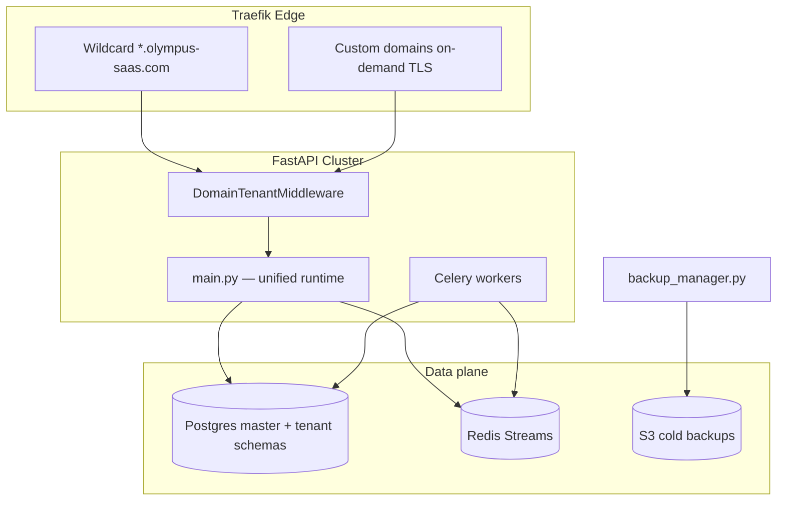

# PROJECT OLYMPUS — Enterprise SaaS Master Blueprint

**Travel & Fleet Management · Multi-Tenant · PostGIS · Zero-Trust IAM**

Stack: **FastAPI (async)** · **PostgreSQL + PostGIS** · **Redis (cache + streams)** · **Traefik (edge)** · **Celery (workers)**

---

## 1. System topology



| Service | Path | Role |
|---------|------|------|
| Unified API | `backend/main.py` | Ticketing + SaaS + OLYMPUS telemetry + driver portal |
| SaaS core | `backend/app/` | Models, billing, audit, GDPR, AADE queue |
| OLYMPUS modules | `backend/olympus/` | Enterprise orchestration layer |
| Platform modules | `backend/travel_platform/` | Fleet, telemetry, revenue, payments |
| Edge | `deploy/traefik/` | SSL, wildcard + on-demand custom domains |
| Compose (local) | `docker-compose.olympus.yml` | Full stack with Celery + Traefik TLS |

---

## PART 1 — Multi-tenant & custom domain infrastructure

### 1.1 Database isolation strategy

Three tiers (configured per tenant `isolation_strategy`):

| Strategy | When | Implementation |
|----------|------|----------------|
| `shared_rls` | Starter / Pro (default) | Single DB, Postgres **RLS** on `tenant_id` |
| `schema` | Professional+ | Dedicated schema `tenant_{slug}` + Alembic per schema |
| `database` | Enterprise | Dedicated PostgreSQL database + connection pool entry |

**Provisioning factory** (`backend/olympus/tenant/provisioning.py`):

1. Stripe webhook `checkout.session.completed` → `TenantProvisioningService.provision_from_stripe()`
2. Create `tenants` row + `subscriptions` row (status `trialing` or `active`)
3. Run Alembic migrations on target (shared / schema / dedicated DB)
4. Seed roles: `tenant_admin`, `staff`, `driver` (passenger is implicit)
5. Write immutable audit entry `TENANT_PROVISIONED`

**Metered billing** (existing + extended):

```sql
-- usage_snapshots (Alembic 003)
active_buses      INT  -- counted from fleet WHERE status = 'active'
monthly_trips     INT  -- COUNT trips executed in billing period
```

Stripe usage records reported via `UsageMeteringService` + Celery beat `report_stripe_usage_all_tenants`.

### 1.2 Traefik — wildcard + on-demand custom domains

See:

- `deploy/traefik/traefik.olympus.yml` — ACME TLS-ALPN-01 + on-demand provider
- `deploy/traefik/dynamic/olympus-on-demand-tls.yml` — custom domain router
- `docker-compose.olympus.yml` — production-like local stack

**Wildcard:** `*.olympus-saas.com` via DNS-01 or wildcard cert on `main` + `sans`.

**Custom domain:** Traefik **OnDemand** TLS with `ask` endpoint → FastAPI validates domain is mapped in `tenants.custom_domain` before cert issuance.

### 1.3 Request context & white-label middleware

`backend/middleware/domain_tenant.py`:

1. Read `Host` header (strip port)
2. Lookup tenant by `custom_domain` OR `{subdomain}.BASE_DOMAIN`
3. Bind to `request.state.tenant_id`, `request.state.theme` (JSON from `tenants.theme_config`)
4. **404** if unmapped (no default tenant leak)
5. Runs **before** JWT middleware for public storefront routes

Theme JSON shape:

```json
{
  "primary": "#005d90",
  "accent": "#0077b6",
  "fontFamily": "Inter",
  "logoUrl": "https://cdn.olympus-saas.com/t/{id}/logo.svg",
  "faviconUrl": "https://..."
}
```

---

## PART 2 — Zero-trust IAM, privacy & audit

### 2.1 Identity hierarchy

```
SuperAdmin (platform) → TenantAdmin → Staff → Driver → Passenger
```

| Role | Scope | MFA required |
|------|-------|--------------|
| `superadmin` | All tenants | Yes |
| `tenant_admin` | Own tenant | Yes |
| `staff` | Desk ops | Configurable |
| `driver` | Manifest / scan | No (Master QR) |
| `passenger` | Own bookings | No |

JWT: RS256 asymmetric keys (`AUTH_JWT_PRIVATE_KEY` / `AUTH_JWT_PUBLIC_KEY`), access 15m, refresh rotation in `app/services/auth_service.py` + `mfa_service.py` (pyotp).

### 2.2 High-risk controls

**Masquerade** (`backend/olympus/security/impersonation.py`):

- SuperAdmin POST `/api/v1/platform/impersonate/{tenant_id}` → short-lived JWT with `impersonating: true`, `original_sub`
- Every action logged to `audit_logs` with action `IMPERSONATION_SESSION`
- Cannot delete audit rows (DB trigger — see migration 005)

**IP whitelist** (`backend/olympus/security/ip_whitelist.py`):

- `tenants.admin_ip_whitelist` JSON array of CIDR strings
- If non-empty, admin routes return **403** unless `X-Forwarded-For` / client IP matches

### 2.3 Disaster recovery & GDPR

| Capability | Module |
|------------|--------|
| Immutable audit | `app/services/audit_service.py` + DB rules |
| Daily encrypted backup | `app/services/backup_manager.py` |
| PITR | `deploy/postgres/pitr-wal-archive.conf` |
| Right to erasure | `app/services/gdpr_service.py` → `/api/v1/compliance/gdpr/erase` |
| Data portability | `gdpr_service.export_tenant_data()` → JSON/ZIP |

---

## PART 3 — Fleet telemetry & driver ecosystem

Implementation lives in `backend/travel_platform/telemetry/` (OLYMPUS engine).

| Feature | Module | Endpoint |
|---------|--------|----------|
| GPS ingestion | `ingestion.py`, `queue.py` | `POST /api/v1/telemetry/update` |
| Idle waste (>5min engine ON, speed 0) | `idle_engine.py` | Alerts via Redis → admin WS |
| Corridor geofence (PostGIS) | `corridor_geofence.py` | `ST_DWithin` 50m buffer |
| Driving score | `driving_behavior.py` | Rolling 0–100 per 100km |
| Dynamic ETA | `eta_intelligence.py` | 5-min refresh → passenger portal |
| Master QR | `operations/master_qr.py` | Issue + `/api/driver/session/master-qr` |
| Driver manifest | `api/driver_portal.py` | Schedule, checklist, expenses |

Redis Stream: `olympus:telemetry:ingest` → consumer in `main.py` lifespan.

---

## PART 4 — Tax compliance & revenue

| Feature | Location |
|---------|----------|
| AADE myDATA async | `app/workers/aade_consumer.py`, `travel_platform/compliance/aade_gateway.py` |
| Abandoned cart recovery | `workers/tasks.py` + `travel_platform/revenue/abandoned_recovery.py` |
| Dynamic pricing | `travel_platform/revenue/dynamic_pricing.py`, seat pricing API |

AADE flow: booking `PAID` → enqueue → worker maps to myDATA XML → store MARK/UID on `aade_submissions`.

---

## Database schema (master catalog)

### Core SaaS (Alembic 001–005)

| Table | Purpose |
|-------|---------|
| `tenants` | Org root, domain, theme, IP whitelist, isolation |
| `users` | RBAC, MFA secret, roles[] |
| `subscriptions` | Stripe status, metered flags |
| `usage_snapshots` | Buses + trips per period |
| `bookings` | Passenger reservations |
| `audit_logs` | Append-only (no UPDATE/DELETE) |
| `aade_submissions` | Fiscal MARK/UID |
| `tenant_provisioning_jobs` | Async onboarding state |

### OLYMPUS telematics (Alembic 005 + `deploy/postgres/olympus-telematics-schema.sql`)

`geofence_zones`, `telemetry_events`, `driving_events`, `driver_safety_profiles`, `vehicle_idle_sessions`, `eta_snapshots`.

---

## Module structure (`backend/olympus/`)

```
olympus/
├── __init__.py
├── config.py                 # OLYMPUS_* settings
├── tenant/
│   ├── provisioning.py       # Stripe → tenant factory
│   └── domain_resolver.py    # Host → tenant + theme
├── security/
│   ├── impersonation.py      # SuperAdmin masquerade
│   └── ip_whitelist.py       # Admin IP gate
└── billing/
    └── metered_usage.py      # Active buses + monthly trips
```

---

## Data isolation guarantees (code level)

1. **Every** tenant-scoped query uses `get_tenant_db()` which executes `SET LOCAL app.current_tenant = :uuid`.
2. Postgres RLS policies on `bookings`, `users`, `audit_logs`, `stops`, `aade_submissions` enforce `tenant_id = current_setting('app.current_tenant')::uuid`.
3. SuperAdmin platform routes use separate session without RLS bypass except explicit `SET ROLE platform_admin` (logged).
4. SQLite ticketing (`ticketing/db.py`) is **legacy dev** — production path syncs to Postgres via `syncTicketForBoarding`.
5. File stores (`payment_settings.json`, `abandoned_carts.json`) must migrate to tenant-scoped Postgres for enterprise; flagged in roadmap.

---

## Operational runbook

### Bootstrap new environment

```bash
cp .env.example .env
docker compose -f docker-compose.olympus.yml up -d
docker compose -f docker-compose.olympus.yml exec web alembic upgrade head
docker compose -f docker-compose.olympus.yml exec web python scripts/seed_saas_dev.py
```

### Daily backup (cron / Celery)

```bash
python -m app.services.backup_manager --tenant all --encrypt
```

### PITR restore (outline)

1. Stop API workers
2. Restore base backup from S3
3. Replay WAL archives to target timestamp
4. Verify `audit_logs` continuity checksum

### Verify tenant isolation

```bash
cd backend && python -m pytest tests/test_olympus_isolation.py -v
```

---

## Implementation status in this repo

| Deliverable | Status |
|-------------|--------|
| FastAPI async modules | ✅ `app/` + `travel_platform/` + `olympus/` |
| PostgreSQL + Alembic | ✅ 001–005 |
| Traefik + on-demand TLS config | ✅ `deploy/traefik/` + `docker-compose.olympus.yml` |
| Domain white-label middleware | ✅ `middleware/domain_tenant.py` |
| Tenant provisioning service | ✅ `app/services/tenant_provisioning_service.py` |
| Backup manager (encrypted S3) | ✅ `app/services/backup_manager.py` |
| IAM + MFA + impersonation | ✅ Partial — impersonation scaffold in `olympus/security/` |
| OLYMPUS telemetry | ✅ `travel_platform/telemetry/` |
| AADE queue | ✅ Pattern complete; production certs = external Vault |
| Celery in local compose | ✅ `docker-compose.olympus.yml` |

---

## Related docs

- [SAAS-ARCHITECTURE.md](./SAAS-ARCHITECTURE.md)
- [OLYMPUS-TELEMATICS.md](./OLYMPUS-TELEMATICS.md)
- [PRODUCTION-ARCHITECTURE.md](./PRODUCTION-ARCHITECTURE.md)
- [GROWTH-AND-CELERY.md](./GROWTH-AND-CELERY.md)
