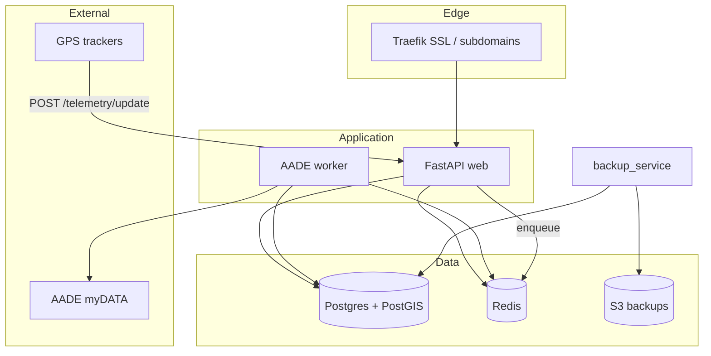

# Project Travel SaaS — Architecture Blueprint

## Master blueprint

See **[PROJECT-OLYMPUS-ENTERPRISE-BLUEPRINT.md](./PROJECT-OLYMPUS-ENTERPRISE-BLUEPRINT.md)** for the complete enterprise specification (Parts 1–4), Traefik on-demand TLS, tenant provisioning factory, and operational runbook.

## System context

## Multi-tenant isolation

| Layer | Mechanism |
|-------|-----------|
| Application | JWT `tenant_id` + `get_tenant_db` dependency |
| ORM | `TenantScopedMixin` + `tenant_scoped_select()` |
| Database | Postgres RLS policies on `bookings`, `users`, `audit_logs`, `stops`, `aade_submissions` |

## Module map

| Module | Location | Responsibility |
|--------|----------|----------------|
| Models | `app/models/` | Tenant, User (RBAC), Booking, Stop, AuditLog, AadeSubmission |
| Auth | `app/core/security.py`, `app/services/auth_service.py` | JWT + password hashing |
| MFA | `app/services/mfa_service.py` | pyotp TOTP |
| AADE | `app/services/aade_queue_service.py`, `app/workers/aade_consumer.py` | Async queue + gateway |
| Telemetry | `app/services/telemetry_service.py` | Normalize GPS + `ST_DWithin` geofence |
| Audit | `app/services/audit_service.py` | Immutable append-only log |
| Backup | `app/services/backup_service.py` | pg_dump → S3 |

## Scalability notes

- **API**: horizontal scale behind Traefik; stateless except JWT; pool_size 10 / max_overflow 20 default.
- **Redis**: AADE queue + email queue keys; use Redis Cluster for HA.
- **Postgres**: read replicas for reporting; primary for writes; partition `bookings` by `created_at` at high volume.
- **Workers**: scale `aade-worker` replicas independently.

## Integration with existing codebase

This repo already includes ticketing (`backend/ticketing`), platform modules (`backend/platform`), and Celery tasks (`backend/workers/tasks.py`). The `app/` package is the **canonical SaaS data model**; wire gradually by migrating platform routes to SQLAlchemy models and shared `get_tenant_db`.
