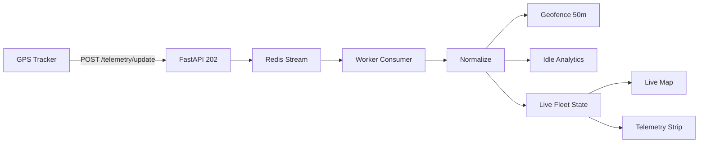

# Real-time Telemetry & Idle Control

> **OLYMPUS modules** (corridor geofence, driving score, ETA): see [OLYMPUS-TELEMATICS.md](./OLYMPUS-TELEMATICS.md).

## Architecture



## 1. Ingestion

**Endpoint:** `POST /telemetry/update`  
**Auth:** `X-Device-Key: dev-gps-key` (env `TELEMETRY_DEVICE_KEYS`)

```json
{
  "tenant_id": "uuid",
  "vehicle_code": "XAH-4021",
  "trip_id": 1,
  "latitude": 38.9,
  "longitude": 22.4,
  "speed_kmh": 0,
  "engine_status": "on",
  "fuel_level_pct": 62
}
```

**Normalization** (`platform/telemetry/processor.py`):

- Maps `vehicle_code` → `fleet_vehicles.id`
- Links `trip_id` → `trip_stops` for geofence
- Persists to `telemetry_points` (Postgres) in production

## 2. Idling

| Rule | Value |
|------|--------|
| Idling | `speed < 3 km/h` AND `engine_on` |
| Alert | duration **> 5 minutes** |
| Idle cost | `(duration_h) × fuel_lph_idle × €/L` |

Default: 2.5 L/h @ €1.85/L → ~€0.15/min idle

## 3. Geofence

- Radius **50m** (config `geofence_radius_m`)
- On entry: `stop_arrival_events` + cache dedup per vehicle/stop
- Stops from `trip_stops` table (demo coords seeded in `GeofenceService`)

## 4. Admin Live Map

- **UI:** `src/components/admin/LiveFleetMap.jsx` (Leaflet dark tiles)
- **Mapbox GL:** set `VITE_MAPBOX_TOKEN` and replace `TileLayer` with Mapbox style URL
- **Heatmap:** grid aggregation of stop coordinates (`GET /api/v1/telemetry/heatmap`)
- **Poll:** `GET /api/v1/telemetry/fleet/live` every 5s

BackOffice tab: **Live GPS**

## 5. Driver App

`TelemetryStrip` on home tab:

- `GET /api/driver/telemetry/trip`
- Shows idle minutes + estimated fuel saved vs baseline

## 6. Scalability

| Layer | Tech |
|-------|------|
| Ingest | Redis Stream `telemetry:ingest`, maxlen 500k |
| Consumer group | `telemetry-workers` |
| Fallback | `asyncio.Queue` in dev without Redis |

## Test

```bash
curl -X POST http://localhost:8000/telemetry/update \
  -H "Content-Type: application/json" \
  -H "X-Device-Key: dev-gps-key" \
  -d '{"tenant_id":"00000000-0000-0000-0000-000000000001","vehicle_code":"XAH-4021","trip_id":1,"latitude":38.899,"longitude":22.433,"speed_kmh":0,"engine_status":"on"}'
```

Admin: simulate via `POST /api/v1/telemetry/simulate` (tenant JWT).
