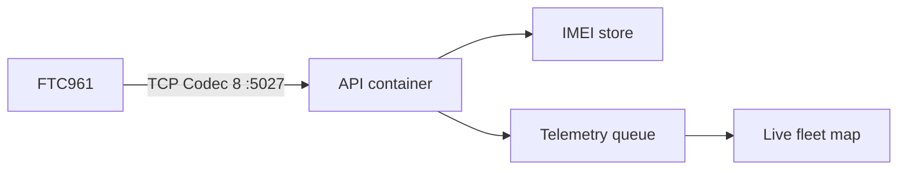

# Teltonika FTC961 — native Codec 8 TCP ingest

## Overview

PoreiaGo listens for Teltonika devices on **TCP port 5027** (Codec 8 / 8E).
IMEI must be bound to an office + vehicle plate in **Ρυθμίσεις → Teltonika GPS**.



## Device setup (Configurator)

1. Open Teltonika Configurator → GPRS
2. **Domain / IP** = public VPS IP (`PLATFORM_INGRESS_IP`)
3. **Port** = `5027`
4. **Protocol** = TCP
5. Codec = **Codec 8** (or Codec 8 Extended)
6. Save & reboot device
7. Open firewall: `ufw allow 5027/tcp` (or cloud security group)

## Admin

1. Back Office → **Ρυθμίσεις → Teltonika GPS**
2. Add IMEI + πινακίδα (`vehicle_code`)
3. Wait for Last seen / pin on **Ζωντανός χάρτης**

## Env

```bash
TELTONIKA_TCP_ENABLED=1
TELTONIKA_TCP_PORT=5027
TELTONIKA_TCP_HOST=0.0.0.0
PLATFORM_INGRESS_IP=x.x.x.x
```

Compose maps `${TELTONIKA_TCP_PORT:-5027}:5027` on `api-blue`.

## Notes

- Unbound / disabled IMEIs are rejected (`0x00` login reply).
- Green Driving IO 253 maps to tracker events 101/102/103.
- Restore / historical playback uses the existing telemetry pipeline.
